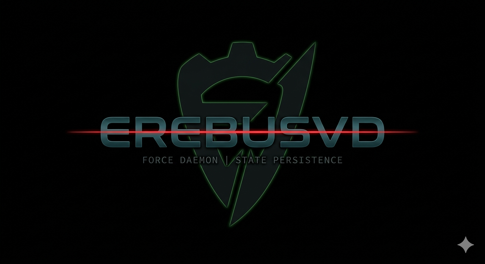

<p align="center">
  
</p>
# ErebusVD (Verification Daemon)

Uma ferramenta acadêmica de força bruta multithreaded desenvolvida em Python. Criada para demonstrar conceitos de redes, concorrência (I/O Bound) e arquitetura de software de segurança.

## Disclaimer Acadêmico
Este projeto foi desenvolvido estritamente para fins educacionais. 
**Não utilize esta ferramenta em servidores onde você não possui autorização explícita.**

## Arquitetura
O ErebusVD utiliza um design pattern modular, separando a engine de execução da lógica de rede.
* **Core Engine:** Gerenciamento de `ThreadPoolExecutor` para maximizar conexões simultâneas.
* **State Persistence:** Sistema de checkpoints (`.status`) que permite pausar e retomar ataques sem perda de progresso.
* **Memory Efficiency:** Leitura de wordlists gigantes sob demanda utilizando *Generators* em Python.

## Como usar
```bash
git clone [https://github.com/SEU_USUARIO/erebus-vd.git](https://github.com/SEU_USUARIO/erebus-vd.git)
cd erebus-vd
pip install paramiko
python main.py -t 192.168.1.100 -u msfadmin -w wordlist.txt -th 1 -d 1.5 -r 3


